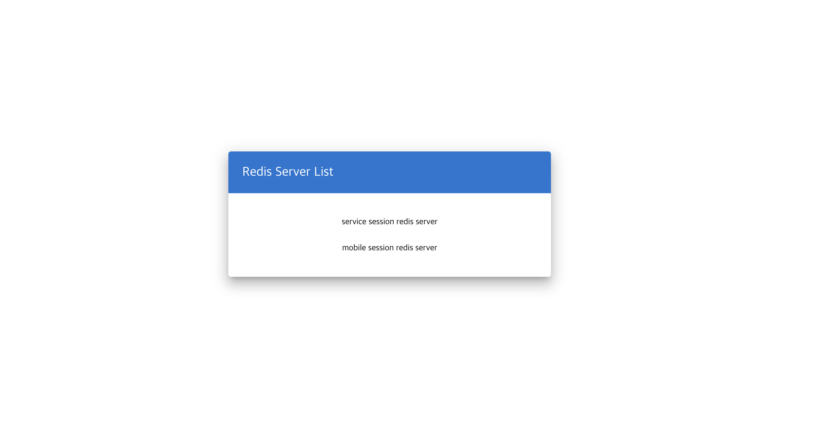
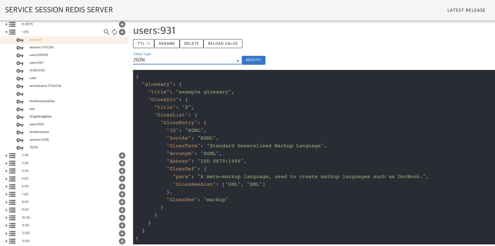
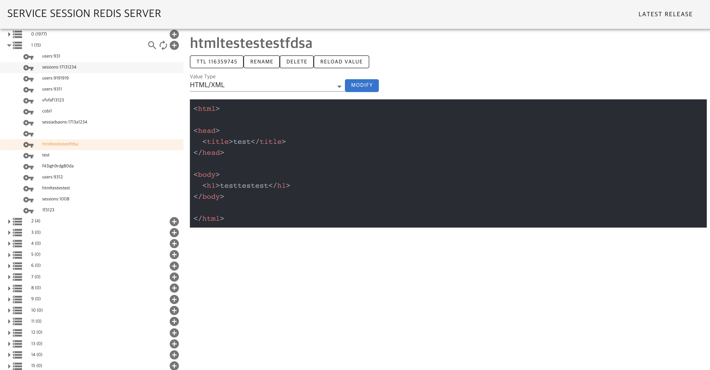

# Redis Web Console
Redis에 관한 CRUD를 위한 Web Console (내가 불편해서 만듬)





## 1. 사용 기술
Spring Boot음(java8), Vue(npm(6.13.4), vue-cli)


## 2. RUN (vue 빌드 포함)
### 2.1 server 등록
#### 2.1.1 application.yml
application.yml의 redis server에 등록
```yaml
list :
    - alias: server1alias¡¡
      hosts : server1host
      password : server1password
      port : 6379
    - alias: server2alias
      hosts : server2hosts
      password : server2password
      port : 1234
```
2.2.2 bean 등록

application.yml을 default로 하지만 `com.console.store.configs.servers.RedisServerInfoListLoader` interface를 구현한 bean을 등록한다면 서버 등록 가능
--> `com.console.store.configs.servers.RedisServerInfoListLoaderByYaml` 참조

### 2.2 run
gradle로 빌드만 진행하면 되지만 내부에 npm 빌드가 먼저 동작하게 세팅되어 있음
```bash
./gradlew bootRun
or 
./gradlew build
```

